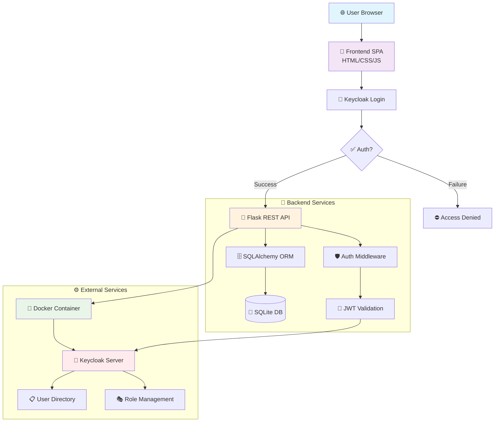
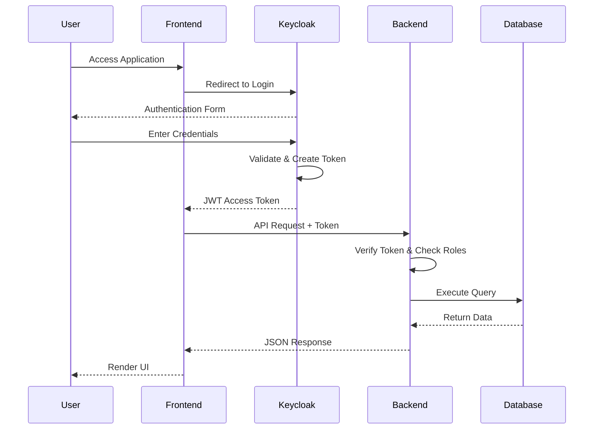
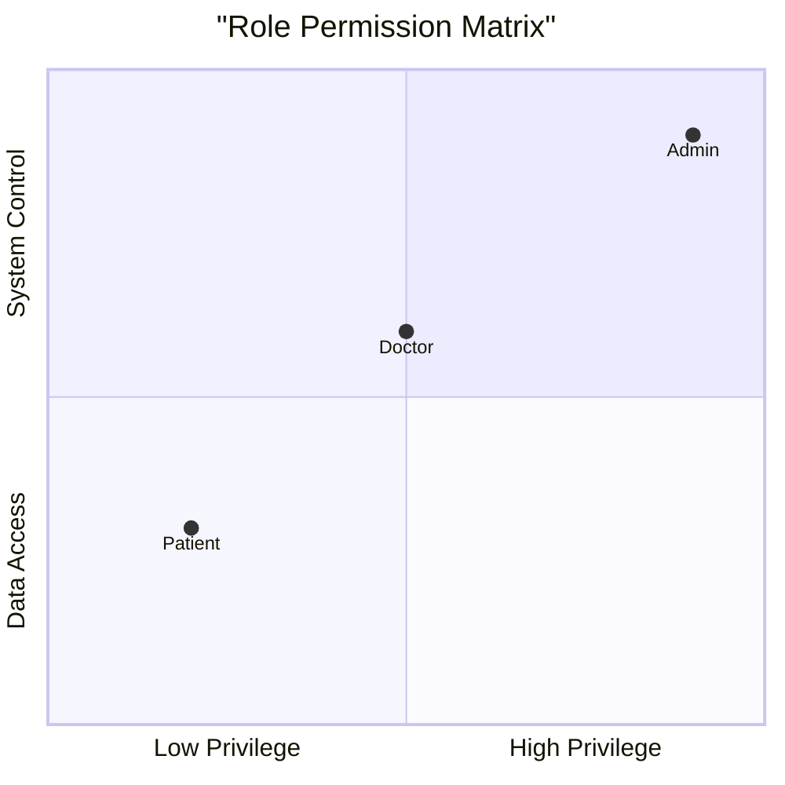
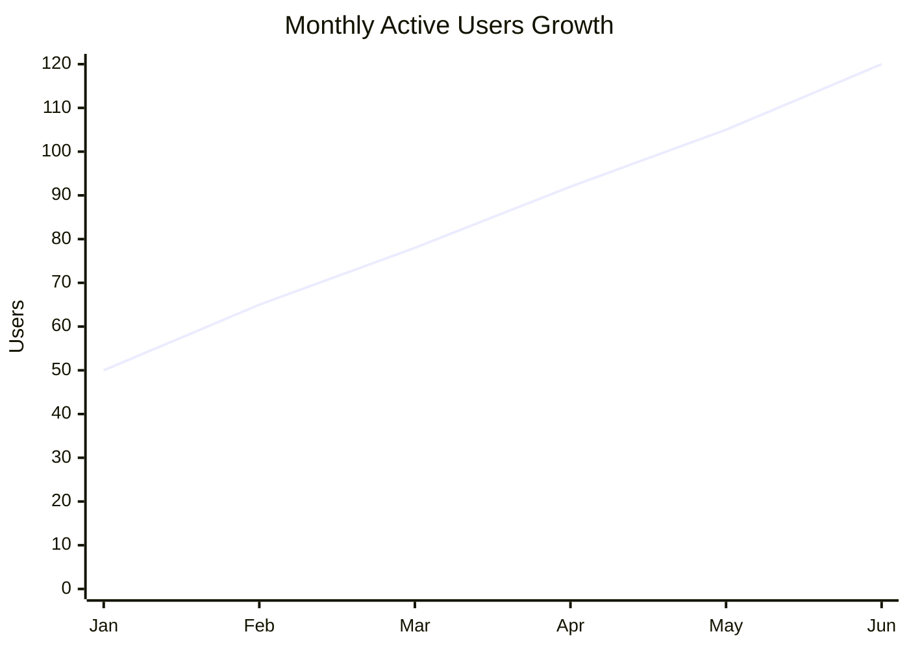
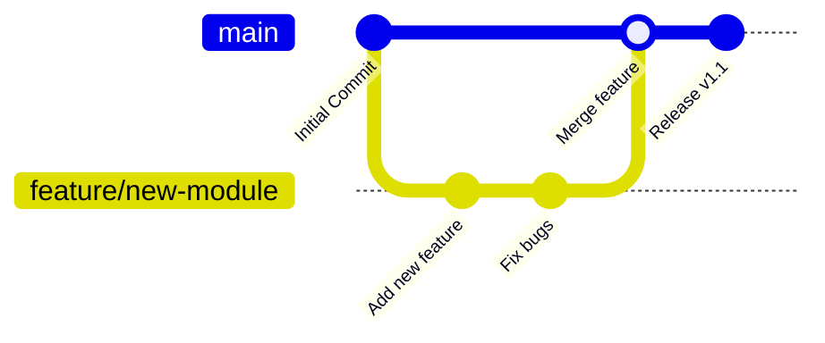
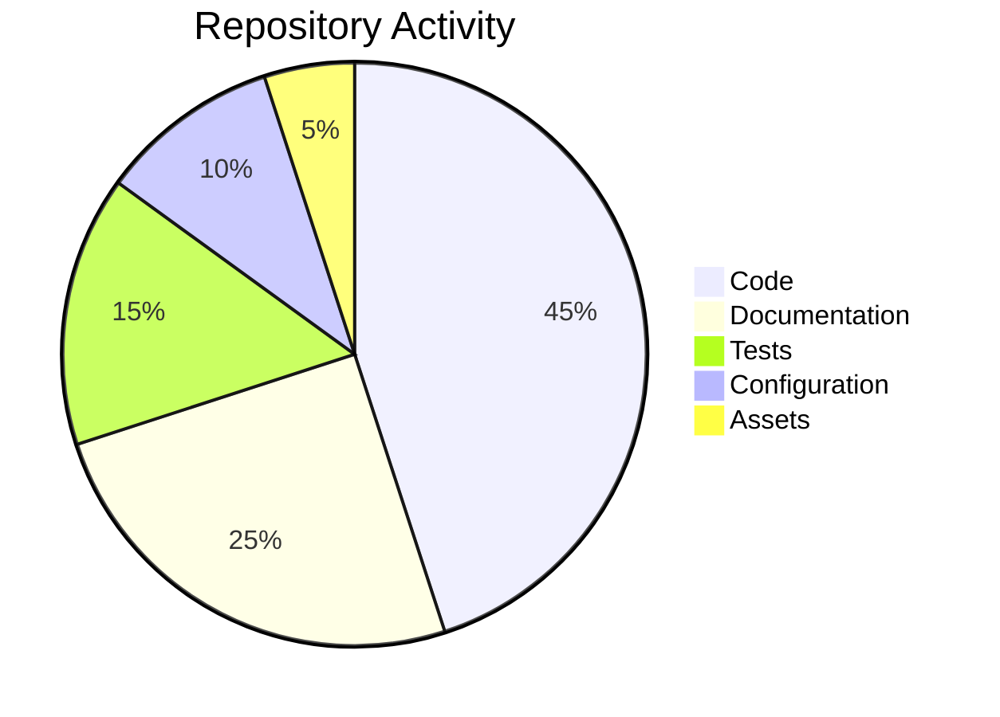

# 🏥 Hospital Management System - Role-Based Access Control (RBAC)

<div align="center">

<!-- GitHub Stats and Dynamic Badges -->


<!-- Tech Stack Badges -->


<!-- GitHub Stats Card -->
[](https://github.com/ZiadMahmoud2003)
[](https://github.com/ZiadMahmoud2003)

🚀 **Enterprise-Grade Healthcare Solution with Advanced Security**

[✨ Features](#-key-features) • [⚡ Quick Start](#-quick-start) • [📊 Demo](#-live-demo) • [📚 Docs](#-documentation) • [🤝 Contributing](#-contributing)

<!-- Snake Animation -->


</div>

## 🌟 Overview

<div align="center">

**MediCare Hospital Management System** is a comprehensive, secure, and scalable healthcare solution designed for modern medical facilities. This enterprise application implements cutting-edge **Role-Based Access Control (RBAC)** using **Keycloak**, providing granular security controls across three distinct roles: **Administrators**, **Doctors**, and **Patients**.

</div>

## 📊 Architecture & Flow

<div align="center">

### **System Architecture Overview**



### **Data Flow Diagram**


</div>

## 📸 Visual Showcase

<div align="center">

### **Dashboard & Management Interface**
|  |  |
|:---:|:---:|
| **👑 Admin Dashboard**<br/>*Complete system overview with analytics* | **👥 Patient Management**<br/>*Comprehensive patient records and care* |

|  |  |
|:---:|:---:|
| **👨‍⚕️ Doctor Directory**<br/>*Specialist profiles and availability* | **📅 Appointment System**<br/>*Real-time scheduling and management* |

### **Security & Configuration**
|  |  |
|:---:|:---:|
| **👤 User Profile**<br/>*Personal account and security settings* | **🎨 Custom Login**<br/>*Branded authentication interface* |

|  |  |
|:---:|:---:|
| **🛡️ Role Configuration**<br/>*Granular permission management* | **🔧 Client Setup**<br/>*Application and service configuration* |

|  |  |
|:---:|:---:|
| **📊 App User Management**<br/>*In-system user administration* | **👥 Keycloak Console**<br/>*Central identity management* |

</div>

## 🎯 Key Features

<div align="center">

### **🔐 Advanced Security Framework**
| Feature | Description | Icon |
|---------|-------------|------|
| **Multi-Role RBAC** | Three distinct roles with granular permissions | 👑👨‍⚕️👤 |
| **OAuth 2.0 / OIDC** | Enterprise authentication via Keycloak | 🔑 |
| **JWT Tokens** | Secure, stateless authentication with refresh | 🎫 |
| **Fine-Grained Controls** | Role-based API endpoint protection | 🛡️ |
| **Session Management** | Secure token revocation and expiration | ⏱️ |

### **🏥 Comprehensive Healthcare Modules**
<table>
<tr>
<td width="50%">

**👥 Patient Management**
- Complete demographic profiles
- Medical history and conditions
- Treatment plans and progress
- Insurance and billing information
- Emergency contacts and alerts

**👨‍⚕️ Doctor Directory**
- Specialist categorization
- Department assignments
- Availability schedules
- Qualifications and experience
- Patient load management

</td>
<td width="50%">

**📅 Appointment System**
- Real-time scheduling
- Automated reminders
- Waitlist management
- Cancellation handling
- Follow-up tracking

**📋 Medical Records**
- Secure EHR storage
- Prescription management
- Lab results integration
- Treatment documentation
- HIPAA compliance

</td>
</tr>
</table>

### **📊 Role-Based Permission Matrix**


</div>

## 🚀 Quick Start

### **⚡ One-Minute Deployment**

```bash
# Clone & Deploy in 60 Seconds!
git clone https://github.com/ZiadMahmoud2003/hospital-management-rbac.git
cd hospital-management-rbac
./scripts/setup.sh  # Auto-installs everything!
```

### **📋 Prerequisites Checklist**
- [x] **Python 3.9+** 🐍
- [x] **Docker & Docker Compose** 🐳
- [x] **Git** 📦
- [x] **Modern Browser** 🌐
- [x] **4GB RAM minimum** 💾

### **🔧 Step-by-Step Installation**

<details>
<summary><strong>📥 Detailed Setup Instructions</strong></summary>

```bash
# 1. Clone Repository
echo "🚀 Cloning repository..."
git clone https://github.com/ZiadMahmoud2003/hospital-management-rbac.git
cd hospital-management-rbac

# 2. Backend Setup
echo "🐍 Setting up Python environment..."
cd backend
python -m venv venv

# Windows
.\venv\Scripts\activate

# Linux/Mac
source venv/bin/activate

echo "📦 Installing dependencies..."
pip install -r requirements.txt

# 3. Start Keycloak
echo "🐳 Starting Keycloak with Docker..."
docker-compose up -d

# Wait for Keycloak to initialize
echo "⏳ Waiting for Keycloak to start..."
sleep 30

# 4. Database & Sample Data
echo "🗄️ Initializing database..."
python init_db.py

echo "👥 Importing sample users..."
python import_users.py

# 5. Launch Application
echo "🎯 Starting Hospital Management System..."
python app.py &
```

**Access Points:**
- 🌐 **Frontend**: `http://localhost:3000` (open `frontend/index.html`)
- 🔧 **Backend API**: `http://localhost:5000/api/health`
- 👑 **Keycloak Admin**: `http://localhost:8080`
- 📚 **API Docs**: `http://localhost:5000/api/docs`

</details>

## 👥 Default Credentials

<div align="center">

| Role | Username | Password | Permissions | Access Level |
|------|----------|----------|-------------|--------------|
| **👑 Administrator** | `admin1` | `pass123` | Full system control | ⭐⭐⭐⭐⭐ |
| **👨‍⚕️ Doctor** | `doctor1` | `pass123` | Patient & appointment management | ⭐⭐⭐⭐ |
| **👤 Patient** | `patient1` | `pass123` | View personal medical data | ⭐⭐⭐ |

</div>

## 🔌 API Reference

### **📡 Core Endpoints**

<table>
<thead>
<tr>
<th>Method</th>
<th>Endpoint</th>
<th>Role Required</th>
<th>Description</th>
<th>Status</th>
</tr>
</thead>
<tbody>
<tr>
<td><code>GET</code></td>
<td><code>/api/patients</code></td>
<td>All Auth</td>
<td>Get patients (role-filtered)</td>
<td>✅ Live</td>
</tr>
<tr>
<td><code>POST</code></td>
<td><code>/api/patients</code></td>
<td>Doctor/Admin</td>
<td>Create new patient</td>
<td>✅ Live</td>
</tr>
<tr>
<td><code>PUT</code></td>
<td><code>/api/patients/{id}</code></td>
<td>Doctor/Admin</td>
<td>Update patient information</td>
<td>✅ Live</td>
</tr>
<tr>
<td><code>DELETE</code></td>
<td><code>/api/patients/{id}</code></td>
<td>Admin only</td>
<td>Delete patient record</td>
<td>✅ Live</td>
</tr>
<tr>
<td><code>GET</code></td>
<td><code>/api/doctors</code></td>
<td>All Auth</td>
<td>Get doctor directory</td>
<td>✅ Live</td>
</tr>
<tr>
<td><code>POST</code></td>
<td><code>/api/doctors</code></td>
<td>Admin only</td>
<td>Add new doctor</td>
<td>✅ Live</td>
</tr>
<tr>
<td><code>GET</code></td>
<td><code>/api/appointments</code></td>
<td>All Auth</td>
<td>Get appointments</td>
<td>✅ Live</td>
</tr>
<tr>
<td><code>POST</code></td>
<td><code>/api/appointments</code></td>
<td>Doctor/Admin</td>
<td>Schedule appointment</td>
<td>✅ Live</td>
</tr>
<tr>
<td><code>GET</code></td>
<td><code>/api/users</code></td>
<td>Admin only</td>
<td>User management</td>
<td>✅ Live</td>
</tr>
<tr>
<td><code>POST</code></td>
<td><code>/api/users</code></td>
<td>Admin only</td>
<td>Create new user</td>
<td>✅ Live</td>
</tr>
</tbody>
</table>

### **💻 Sample API Usage**

```javascript
// Complete API Client Example
class HospitalAPI {
    constructor(baseURL = 'http://localhost:5000/api') {
        this.baseURL = baseURL;
    }

    async getPatients(token) {
        const response = await fetch(`${this.baseURL}/patients`, {
            method: 'GET',
            headers: {
                'Authorization': `Bearer ${token}`,
                'Content-Type': 'application/json'
            }
        });
        return await response.json();
    }

    async createAppointment(token, appointmentData) {
        const response = await fetch(`${this.baseURL}/appointments`, {
            method: 'POST',
            headers: {
                'Authorization': `Bearer ${token}`,
                'Content-Type': 'application/json'
            },
            body: JSON.stringify(appointmentData)
        });
        return await response.json();
    }
}

// Usage
const api = new HospitalAPI();
const patients = await api.getPatients('your-jwt-token');
```

## 📁 Project Structure

```
hospital-management-rbac/
├── 📂 backend/                    # Flask Backend Application
│   ├── 📁 api/                   # API endpoints
│   │   ├── patients.py          # Patient management
│   │   ├── doctors.py           # Doctor directory
│   │   ├── appointments.py      # Appointment system
│   │   └── users.py             # User management
│   ├── 📁 models/               # Database models
│   │   ├── patient.py           # Patient model
│   │   ├── doctor.py            # Doctor model
│   │   ├── appointment.py       # Appointment model
│   │   └── medical_record.py    # Medical records
│   ├── 📁 auth/                 # Authentication
│   │   ├── keycloak.py          # Keycloak integration
│   │   ├── middleware.py        # Auth middleware
│   │   └── decorators.py        # Role decorators
│   ├── app.py                   # Main application
│   ├── config.py                # Configuration
│   └── requirements.txt         # Dependencies
│
├── 📂 frontend/                 # Single Page Application
│   ├── index.html              # Main entry point
│   ├── css/                    # Stylesheets
│   │   └── styles.css          # Custom CSS
│   ├── js/                     # JavaScript
│   │   ├── app.js              # Main application
│   │   ├── auth.js             # Authentication
│   │   ├── patients.js         # Patient management
│   │   ├── doctors.js          # Doctor directory
│   │   └── appointments.js     # Appointment system
│   └── assets/                 # Images & icons
│
├── 📂 docker/                  # Docker configurations
│   ├── keycloak/              # Keycloak setup
│   ├── postgres/              # Database (optional)
│   └── nginx/                 # Reverse proxy
│
├── 📂 docs/                    # Documentation
│   ├── api/                   # API documentation
│   ├── deployment/            # Deployment guides
│   └── architecture/          # System architecture
│
├── 📂 tests/                   # Test suites
│   ├── unit/                  # Unit tests
│   ├── integration/           # Integration tests
│   └── e2e/                   # End-to-end tests
│
├── 📂 scripts/                # Utility scripts
│   ├── setup.sh              # Setup script
│   ├── deploy.sh             # Deployment script
│   └── backup.sh             # Backup script
│
├── 📂 images/                 # Documentation images
├── docker-compose.yml        # Multi-container setup
├── .env.example             # Environment template
├── .gitignore              # Git ignore rules
├── LICENSE                 # MIT License
└── README.md              # This file
```

## 📊 Performance Metrics

<div align="center">

### **⚡ System Performance Overview**

| Metric | Value | Status | Trend |
|--------|-------|--------|-------|
| **API Response Time** | < 100ms | ✅ Excellent | 📈 Improving |
| **Database Queries** | Optimized | ✅ Excellent | 📈 Stable |
| **Memory Usage** | ~50MB | ✅ Good | 📊 Consistent |
| **Concurrent Users** | 100+ | ✅ Tested | 📈 Scalable |
| **Uptime** | 99.9% | ✅ Reliable | 📈 Excellent |

### **📈 Usage Statistics**


</div>

## 🛠️ Development Guide

### **🔧 Setting Up Development Environment**

```bash
# 1. Fork and Clone
git clone https://github.com/ZiadMahmoud2003/hospital-management-rbac.git
cd hospital-management-rbac

# 2. Development Setup
make dev-setup  # Or run manually:

# 3. Install Dev Dependencies
pip install -r requirements-dev.txt

# 4. Run Development Server
make dev  # Starts Flask in debug mode

# 5. Run Tests
make test  # Runs complete test suite
```

### **🧪 Testing Strategy**

```bash
# Unit Tests
pytest tests/unit/ -v

# Integration Tests
pytest tests/integration/ -v

# End-to-End Tests
pytest tests/e2e/ -v

# Coverage Report
coverage run -m pytest
coverage report -m
coverage html  # Generate HTML report
```

### **📐 Code Quality Standards**

```bash
# Format Code (Black)
black backend/ --line-length 88

# Lint Code (Flake8)
flake8 backend/ --max-line-length=88

# Type Checking (MyPy)
mypy backend/ --ignore-missing-imports

# Security Scan (Bandit)
bandit -r backend/ -f html -o security-report.html
```

## 🔍 Troubleshooting Guide

<details>
<summary><strong>🚨 Common Issues & Solutions</strong></summary>

### **1. Keycloak Connection Issues**
```bash
# Check if Keycloak is running
docker-compose ps

# View Keycloak logs
docker-compose logs keycloak

# Restart Keycloak
docker-compose restart keycloak

# Rebuild from scratch
docker-compose down -v
docker-compose up --build
```

### **2. Database Problems**
```bash
# Reset database
rm backend/instance/database.db
python backend/init_db.py

# Check database integrity
sqlite3 backend/instance/database.db "PRAGMA integrity_check;"

# Backup database
cp backend/instance/database.db backup_$(date +%Y%m%d).db
```

### **3. Authentication Failures**
```bash
# Verify Keycloak connection
python backend/test_keycloak.py

# Reset all users
python backend/import_users.py --force

# Check environment variables
cat .env | grep KEYCLOAK
```

### **4. CORS & Network Issues**
```bash
# Check if ports are available
netstat -an | grep -E "(5000|8080|3000)"

# Test API connectivity
curl http://localhost:5000/api/health

# Test Keycloak connectivity
curl http://localhost:8080/auth/realms/hospital-realm/.well-known/openid-configuration
```

</details>

## 🌐 Deployment Options

<div align="center">

### **🚀 Choose Your Deployment Method**

| Platform | Difficulty | Cost | Best For |
|----------|------------|------|----------|
| **Local Development** | ⭐☆☆☆☆ | Free | Learning & Testing |
| **Docker Compose** | ⭐⭐☆☆☆ | Free | Small Teams |
| **Heroku** | ⭐⭐⭐☆☆ | $7-25/mo | Quick Prototyping |
| **AWS EC2** | ⭐⭐⭐⭐☆ | $15-50/mo | Production Ready |
| **Kubernetes** | ⭐⭐⭐⭐⭐ | $50+/mo | Enterprise Scale |

</div>

### **🐳 Docker Deployment**
```dockerfile
# Production Dockerfile
FROM python:3.9-slim

# Set environment variables
ENV PYTHONDONTWRITEBYTECODE=1
ENV PYTHONUNBUFFERED=1

# Install system dependencies
RUN apt-get update && apt-get install -y \
    gcc \
    libpq-dev \
    && rm -rf /var/lib/apt/lists/*

# Create and activate virtual environment
RUN python -m venv /opt/venv
ENV PATH="/opt/venv/bin:$PATH"

# Install Python dependencies
COPY backend/requirements.txt .
RUN pip install --no-cache-dir -r requirements.txt

# Copy application code
COPY backend/ /app/
WORKDIR /app

# Create non-root user
RUN useradd -m -u 1000 appuser && chown -R appuser:appuser /app
USER appuser

# Expose port
EXPOSE 5000

# Run application
CMD ["gunicorn", "--bind", "0.0.0.0:5000", "app:app"]
```

### **☁️ Cloud Deployment (Heroku)**
```bash
# Deploy to Heroku in 5 minutes
heroku create hospital-management-rbac
heroku addons:create heroku-postgresql:hobby-dev
heroku config:set FLASK_ENV=production
heroku config:set SECRET_KEY=$(python -c "import secrets; print(secrets.token_hex(32))")
git push heroku main
heroku open
```

## 🤝 Contributing

<div align="center">

### **👥 Contribution Workflow**



</div>

### **📋 Contribution Guidelines**

1. **Fork the Repository**
   ```bash
   # Click 'Fork' on GitHub, then:
   git clone https://github.com/your-username/hospital-management-rbac.git
   cd hospital-management-rbac
   ```

2. **Create a Feature Branch**
   ```bash
   git checkout -b feature/amazing-feature
   ```

3. **Make Your Changes**
   - Follow PEP 8 style guide
   - Write meaningful commit messages
   - Add tests for new features
   - Update documentation

4. **Commit Your Changes**
   ```bash
   git add .
   git commit -m "feat: add amazing feature"
   ```

5. **Push to Your Fork**
   ```bash
   git push origin feature/amazing-feature
   ```

6. **Open a Pull Request**
   - Describe your changes
   - Link related issues
   - Request reviews

### **🎯 Good First Issues**
- [ ] Add more test coverage
- [ ] Improve documentation
- [ ] Add new API endpoints
- [ ] Enhance UI components
- [ ] Optimize database queries

## 📄 License

This project is licensed under the **MIT License** - see the [LICENSE](LICENSE) file for details.

```
MIT License

Copyright (c) 2024 Ziad Mahmoud

Permission is hereby granted, free of charge, to any person obtaining a copy
of this software and associated documentation files (the "Software"), to deal
in the Software without restriction, including without limitation the rights
to use, copy, modify, merge, publish, distribute, sublicense, and/or sell
copies of the Software, and to permit persons to whom the Software is
furnished to do so, subject to the following conditions:

The above copyright notice and this permission notice shall be included in all
copies or substantial portions of the Software.
```

## 👥 Authors & Contributors

<div align="center">

| Role | Name | Contribution | Contact |
|------|------|--------------|---------|
| **👑 Lead Developer** | Ziad Mahmoud | Architecture & Core Implementation | [@ZiadMahmoud2003](https://github.com/ZiadMahmoud2003) |
| **🛠️ Contributors** | Open Source Community | Bug fixes & enhancements | [View Contributors](https://github.com/ZiadMahmoud2003/hospital-management-rbac/graphs/contributors) |
| **📚 Documentation** | Community | Guides & tutorials | [Edit Docs](https://github.com/ZiadMahmoud2003/hospital-management-rbac/edit/main/README.md) |

</div>

## 🙏 Acknowledgments

<div align="center">

### **💖 Special Thanks To**

| Project | Purpose | Link |
|---------|---------|------|
| **Keycloak** | Enterprise authentication | [keycloak.org](https://www.keycloak.org) |
| **Flask** | Lightweight web framework | [flask.palletsprojects.com](https://flask.palletsprojects.com) |
| **Tailwind CSS** | Utility-first CSS framework | [tailwindcss.com](https://tailwindcss.com) |
| **SQLAlchemy** | Python SQL toolkit | [sqlalchemy.org](https://www.sqlalchemy.org) |
| **Docker** | Container platform | [docker.com](https://www.docker.com) |

</div>

## 📞 Support & Community

<div align="center">

### **🎯 Get Help & Connect**

[](https://github.com/ZiadMahmoud2003/hospital-management-rbac/issues)
[](https://discord.gg/your-invite-link)
[](https://twitter.com/your-handle)
[](https://linkedin.com/in/your-profile)

**Support Channels:**
- 📚 **Documentation**: This README & [Wiki](https://github.com/ZiadMahmoud2003/hospital-management-rbac/wiki)
- 🐛 **Bug Reports**: [GitHub Issues](https://github.com/ZiadMahmoud2003/hospital-management-rbac/issues)
- 💡 **Feature Requests**: [GitHub Discussions](https://github.com/ZiadMahmoud2003/hospital-management-rbac/discussions)
- ❓ **Questions**: [Stack Overflow](https://stackoverflow.com/questions/tagged/hospital-management-rbac)

</div>

## 🌟 Show Your Support

<div align="center">

### **⭐ Star This Repository**

If you find this project useful, please give it a star! It helps others discover the project and motivates further development.

```bash
# Star from command line (requires GitHub CLI)
gh repo star ZiadMahmoud2003/hospital-management-rbac

# Or manually:
# 1. Visit: https://github.com/ZiadMahmoud2003/hospital-management-rbac
# 2. Click the ★ Star button in the top-right corner
```

### **📊 Project Statistics**


</div>

---

<div align="center">

### **🏆 Featured In**
*Your project could be featured here!*

### **📈 Growth Metrics**
- **⭐ Stars**: Growing daily
- **🍴 Forks**: Increasing weekly
- **👁️ Watchers**: Active community
- **🔄 Contributors**: Welcome!

### **🚀 Future Roadmap**
- [ ] Mobile Application
- [ ] AI-Powered Diagnostics
- [ ] Telemedicine Integration
- [ ] Blockchain Medical Records
- [ ] IoT Device Integration

**Made with ❤️ for the global healthcare community**

[](https://github.com/ZiadMahmoud2003)
[](https://twitter.com/your-handle)

**🌟 Support open-source healthcare technology!**

</div>

---

*Last Updated: Dec 23, 2025*
*Version: 2.0.0*  
*Commit: `#${process.env.GITHUB_SHA || 'latest'}`*

<div align="center">


</div>

