```markdown
<a name="readme-top"></a>

<div align="center">

  <h1>🏥 MediCare RBAC System</h1>

  <a href="https://git.io/typing-svg">
    
  </a>

  <p>
    <a href="https://github.com/ZiadMahmoud2003/hospital-management-rbac/graphs/contributors">
      
    </a>
    <a href="https://github.com/ZiadMahmoud2003/hospital-management-rbac/network/members">
      
    </a>
    <a href="https://github.com/ZiadMahmoud2003/hospital-management-rbac/stargazers">
      
    </a>
    <a href="https://github.com/ZiadMahmoud2003/hospital-management-rbac/issues">
      
    </a>
    <a href="https://github.com/ZiadMahmoud2003/hospital-management-rbac/blob/main/LICENSE">
      
    </a>
  </p>

  <h4>
    <a href="#-demo">View Demo</a> •
    <a href="#-installation">Installation</a> •
    <a href="#-documentation">Docs</a> •
    <a href="https://github.com/ZiadMahmoud2003/hospital-management-rbac/issues">Report Bug</a>
  </h4>
</div>

<br />

<details>
  <summary><b>📚 Table of Contents</b></summary>
  <ol>
    <li><a href="#-about-the-project">About The Project</a></li>
    <li><a href="#-system-architecture">System Architecture</a></li>
    <li><a href="#-visual-showcase">Visual Showcase</a></li>
    <li><a href="#-core-features">Core Features</a></li>
    <li><a href="#-getting-started">Getting Started</a></li>
    <li><a href="#-role-based-access-matrix">RBAC Matrix</a></li>
    <li><a href="#-api-reference">API Reference</a></li>
    <li><a href="#-contributing">Contributing</a></li>
  </ol>
</details>

---

## 🌟 About The Project

**MediCare Hospital Management System** is a next-generation healthcare solution designed to bridge the gap between patient care and administrative security. Unlike traditional systems, MediCare integrates **Keycloak** to provide an enterprise-grade Identity and Access Management (IAM) layer.

This project ensures that sensitive medical data is accessible *only* to authorized personnel through a strict **Role-Based Access Control (RBAC)** mechanism, distinguishing seamlessly between Administrators, Doctors, and Patients.

### 🛠️ Tech Stack

| Component | Technology | Badge |
| :--- | :--- | :--- |
| **Backend** | Python Flask |  |
| **Frontend** | JS & Tailwind |  |
| **Security** | Keycloak |  |
| **Container** | Docker |  |
| **Database** | SQLAlchemy |  |

<p align="right">(<a href="#readme-top">back to top</a>)</p>

---

## 🏗 System Architecture

We utilize a microservices-inspired architecture where authentication is decoupled from the core application logic.

```mermaid
graph TD
    User((👤 User))
    LB[🌐 Frontend UI]
    API[⚙️ Backend API Flask]
    Auth[🔐 Keycloak Server]
    DB[(🗄️ Database)]

    User -->|HTTPS| LB
    LB -->|1. Request Login| Auth
    Auth -->|2. Return JWT Token| LB
    LB -->|3. API Request + Bearer Token| API
    API -->|4. Validate Token| Auth
    API -->|5. Query Data| DB
    DB -->|6. Return Data| API
    API -->|7. JSON Response| LB

```



<p align="right">(<a href="#readme-top">back to top</a>)</p>

---

## 📸 Visual Showcase

<table width="100%">
<tr>
<td width="50%" align="center">
<b>📊 Admin Dashboard</b>


</td>
<td width="50%" align="center">
<b>🏥 Patient Management</b>


</td>
</tr>
<tr>
<td width="50%" align="center">
<b>👨‍⚕️ Doctor Directory</b>


</td>
<td width="50%" align="center">
<b>📅 Appointments</b>


</td>
</tr>
<tr>
<td width="50%" align="center">
<b>🔐 Keycloak Roles</b>


</td>
<td width="50%" align="center">
<b>👥 User Console</b>


</td>
</tr>
</table>

<p align="right">(<a href="#readme-top">back to top</a>)</p>

---

## 🚀 Core Features

### 🔐 **Advanced Security**

* **OAuth 2.0 / OIDC:** Seamless integration with Keycloak.
* **JWT Authentication:** Secure stateless session management with refresh tokens.
* **Granular Permissions:** Fine-tuned access control down to the API endpoint level.

### 🏥 **Hospital Modules**

* **Patient Profiles:** Detailed medical history and condition tracking.
* **Doctor Directory:** Searchable specialist database.
* **Appointment Engine:** Real-time scheduling with status tracking.

### 💻 **Developer Experience**

* **Dockerized:** Ready-to-deploy containers.
* **RESTful API:** Clean, documented endpoints.
* **Bulk Import:** CSV support for rapid user onboarding.

<p align="right">(<a href="#readme-top">back to top</a>)</p>

---

## ⚡ Getting Started

Follow these steps to set up the environment locally.

### Prerequisites

* 🐍 Python 3.9+
* 🐳 Docker & Docker Compose
* 🐙 Git

### Installation Guide

<details>
<summary><b>🔻 Click to expand detailed installation steps</b></summary>

1. **Clone the repository**
```bash
git clone [https://github.com/ZiadMahmoud2003/hospital-management-rbac.git](https://github.com/ZiadMahmoud2003/hospital-management-rbac.git)
cd hospital-management-rbac

```


2. **Backend Setup**
```bash
cd backend
python -m venv venv
# Windows: venv\Scripts\activate
# Mac/Linux: source venv/bin/activate
pip install -r requirements.txt

```


3. **Start Authentication Server (Keycloak)**
Open a new terminal:
```bash
docker-compose up -d

```


*Wait for Keycloak to initialize (approx 1-2 mins).*
4. **Initialize System**
```bash
python init_db.py
python import_users.py

```


5. **Launch Application**
```bash
python app.py

```


🟢 **Frontend:** `frontend/index.html`
🟠 **API:** `http://localhost:5000`
🔵 **Keycloak:** `http://localhost:8080` (admin/admin)

</details>

<p align="right">(<a href="#readme-top">back to top</a>)</p>

---

## 🛡 Role-Based Access Matrix

We enforce strict separation of duties. Use the credentials below for testing.

| Role | Username | Password | Access Level | Description |
| --- | --- | --- | --- | --- |
| 👑 **Admin** | `admin1` | `pass123` | **Full Access** | Manage Users, Doctors, System Config |
| 👨‍⚕️ **Doctor** | `doctor1` | `pass123` | **Write/Edit** | Manage Patients, Treatments, Appointments |
| 👤 **Patient** | `patient1` | `pass123` | **Read Only** | View own Medical Records & Profile |

<p align="right">(<a href="#readme-top">back to top</a>)</p>

---

## 🔌 API Reference

The backend exposes a RESTful API secured by Bearer tokens.

<details>
<summary><b>📑 View Endpoints</b></summary>

| Method | Endpoint | Access | Description |
| --- | --- | --- | --- |
| `GET` | `/api/patients` | 🟢 All | Get list of patients (Scope filtered) |
| `POST` | `/api/patients` | 🟠 Doc/Admin | Register new patient |
| `PUT` | `/api/patients/{id}` | 🟠 Doc/Admin | Update medical records |
| `DELETE` | `/api/patients/{id}` | 🔴 Admin | Remove patient record |
| `GET` | `/api/doctors` | 🟢 All | Retrieve doctor directory |
| `POST` | `/api/appointments` | 🟠 Doc/Admin | Schedule new appointment |

**Sample Request:**

```javascript
fetch('http://localhost:5000/api/patients', {
  method: 'GET',
  headers: {
    'Authorization': 'Bearer <YOUR_JWT_TOKEN>',
    'Content-Type': 'application/json'
  }
})

```

</details>

<p align="right">(<a href="#readme-top">back to top</a>)</p>

---

## 🤝 Contributing

Contributions make the open-source community an amazing place to learn, inspire, and create. Any contributions you make are **greatly appreciated**.

1. Fork the Project
2. Create your Feature Branch (`git checkout -b feature/AmazingFeature`)
3. Commit your Changes (`git commit -m 'Add some AmazingFeature'`)
4. Push to the Branch (`git push origin feature/AmazingFeature`)
5. Open a Pull Request

<p align="right">(<a href="#readme-top">back to top</a>)</p>

---

## 👥 Author

<div align="center">

**Ziad Mahmoud**

</div>

---

<div align="center">


**Star this repo if you find it useful!** ⭐

</div>

